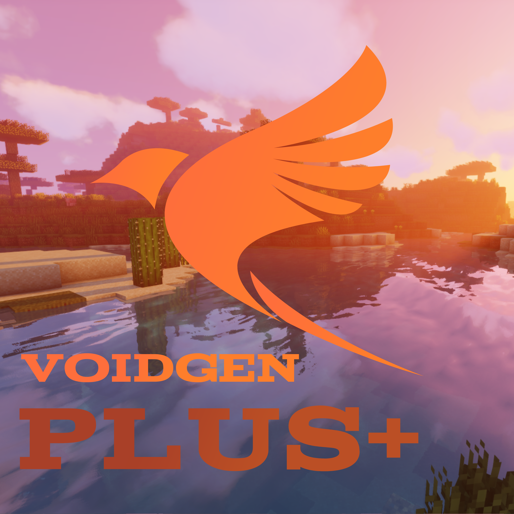

  
    
  
  
  
  
  

# VoidGen+

**VoidGen+** is a Minecraft plugin that allows server owners to generate and manage
custom void worlds using a powerful yet lightweight generator system.

This project is a **fork of the original VoidGen plugin**:  
https://github.com/NicoNekoDev/VoidGen

VoidGen+ is developed and maintained independently, with a focus on
maintainability, flexibility, and future improvements.

> ⚠️ **Important**  
> If you encounter bugs or crashes related to VoidGen+, please **do not**
> report them to the original VoidGen Discord server.  
> Instead, report issues in the **VoidGen+ Discord server**:
> https://dc.gg/developer

---

## Features

- Create unlimited custom void worlds
- Lightweight and efficient world generation
- Simple configuration and setup
- Designed for scalability and future extensions

---

## Getting Started

You can find setup and usage instructions on the
[VoidGen+ tutorial](docs/tutorial.md).

> Most systems remain compatible with the original VoidGen setup.

---

<!--
## FAQ

Find answers to common questions on the [FAQ page](docs/faq.md).
-->

## License

VoidGen+ is licensed under the **MIT License**.

This project is a fork of **VoidGen**, originally licensed under
**GNU GPL v3.0**, and is now maintained separately under the MIT license.

See the full license here:  
[GitHub Repository (License)](LICENSE)
